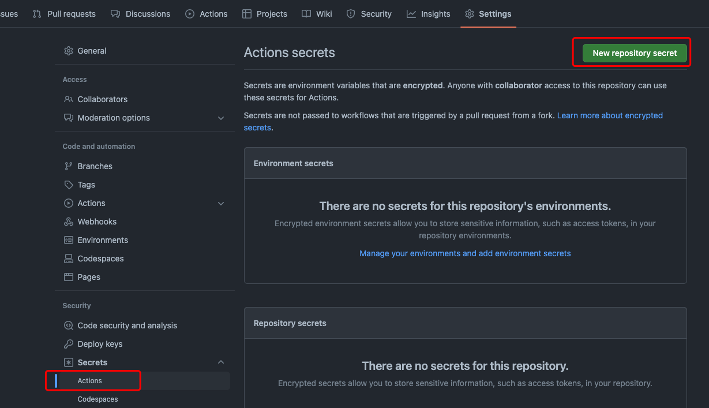
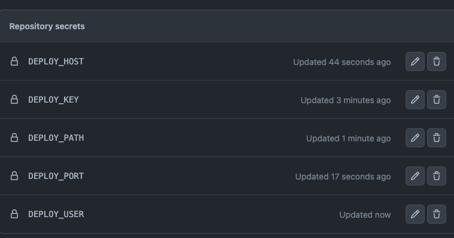
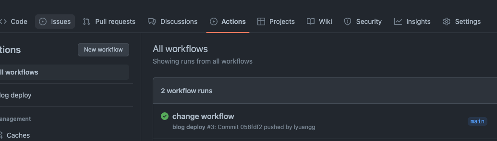

<!--more-->

## 1. 概述

目前我的博客发布流程是： 

1. 执行 hugo 命令编译成静态页面。
2. 同步静态页面到自己的服务器上。

自动部署就是在 `git push` 时自动触发执行上面两个步骤，这时候就需要使用 `Github Actions` 了。

## 2. Github Actions

GitHub Actions 是一种持续集成和持续交付 (CI/CD) 平台，允许在存储库中发生其他事件时运行工作流程，可用于自动执行生成、测试和部署的功能。 

#### 基本概念： 

1. workflow ：工作流，每个工作流对应一个 YAML 格式的文件，放在代码仓库的 `.github/workflows` 目录。
2. job：任务， 一个 workflow 由一个或多个 jobs 构成。
3. step：步骤， 每个 job 由多个 step 构成。
4. action： 动作， 每个 step 可以依次执行一个或多个命令。

Github 提供了一个 Marketplace 用来共享 action，可以直接使用别人写好的 action 。

使用 `userName/repoName@tag` 的语法引用 action。 
GitHub 官方的 actions 都放在 github.com/actions 里面。

## 3. 实现

### 1. 编写一个 workflow 脚本

创建文件 `.github/workflows/blog-deploy.yml`

```yaml
name: blog deploy # workflow 的名字

# 触发事件 https://docs.github.com/en/actions/using-workflows/events-that-trigger-workflow
on:  
  push:  # git push 事件
    branches:
      - main  # 指定分支

jobs:
  deploy:  # job 名字
    runs-on: ubuntu-20.04   # 运行环境，Github 提供的运行 job 的虚拟机， https://docs.github.com/en/actions/using-jobs/choosing-the-runner-for-a-job#choosing-github-hosted-runners
    steps:
      - uses: actions/checkout@v3   # 使用 github 提供的 action， 拉取代码
        with:
          submodules: true  # Fetch Hugo themes (true OR recursive)
          fetch-depth: 0    # Fetch all history for .GitInfo and .Lastmod

      - name: Setup Hugo           # 步骤名字
        uses: peaceiris/actions-hugo@v2  # 安装 hugo
        with:
          hugo-version: latest
          extended: true

      - name: Build                
        run: hugo           # 执行命令 hugo 编译为静态文件

      - name: Deploy
        uses: burnett01/rsync-deployments@5.2   # 同步到服务器
        with:
          switches: -avzr --delete
          path: ./public/
          remote_path: ${{ secrets.DEPLOY_PATH }} # 远程主机目录
          remote_host: ${{ secrets.DEPLOY_HOST }} # 远程主机 IP
          remote_port: ${{ secrets.DEPLOY_PORT }} # ssh 端口，默认为 22
          remote_user: ${{ secrets.DEPLOY_USER }} # ssh user
          remote_key: ${{ secrets.DEPLOY_KEY }} # ssh 私钥
```

### 2. 配置 ssh，设置 secrets

1. 登录远程服务器添加用户  

```bash
# 添加用户
useradd -g web github

# 添加目录
mkdir /web/blog
chown github.web /web/blog
```

2. 切换用户生成公私钥 

```bash
su github
ssh-keygen -t rsa
cat ~/.ssh/id_rsa.pub >> ~/.ssh/authorized_keys
chmod 600 ~/.ssh/authorized_keys
```
3. 配置 secrets



### 测试效果

执行 `git push` 查看 `action` 执行结果

